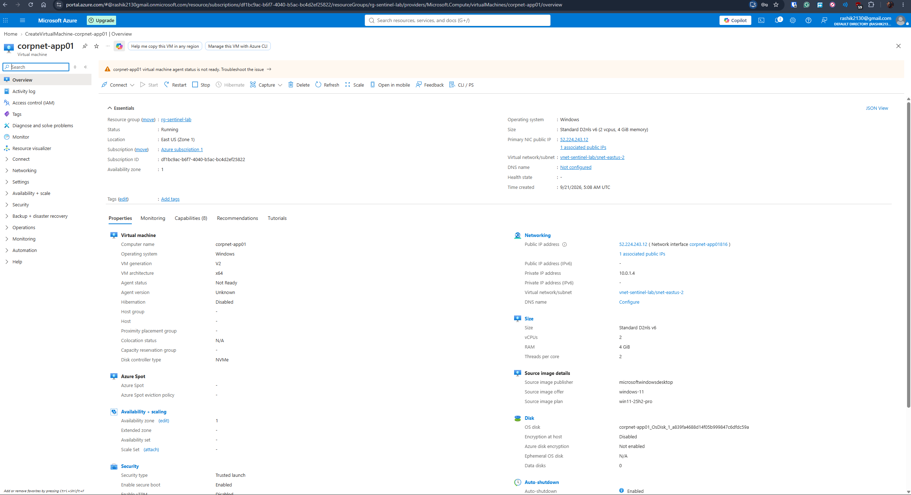
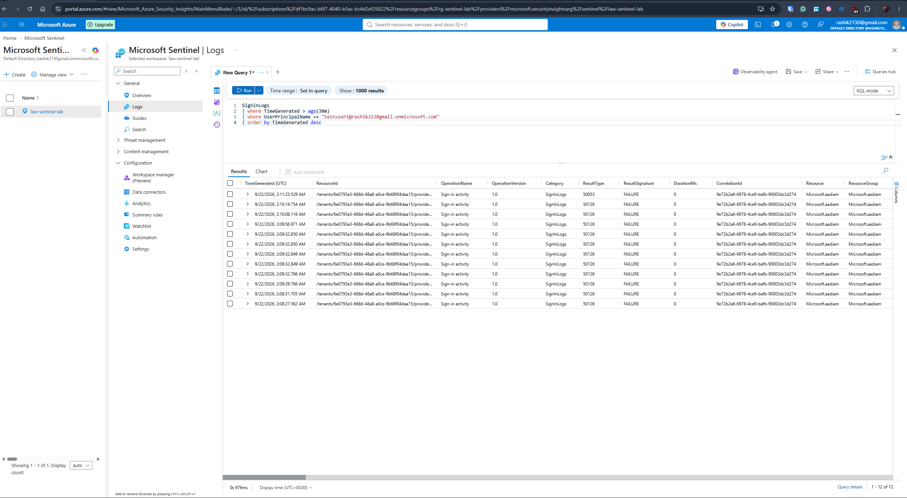
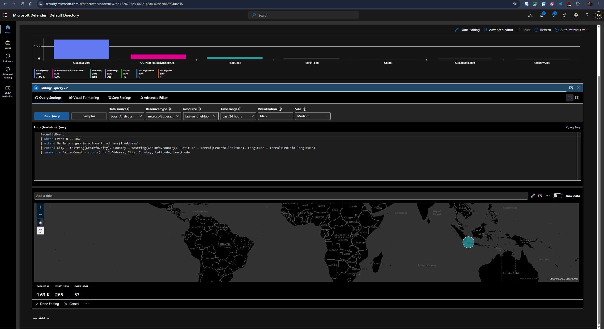
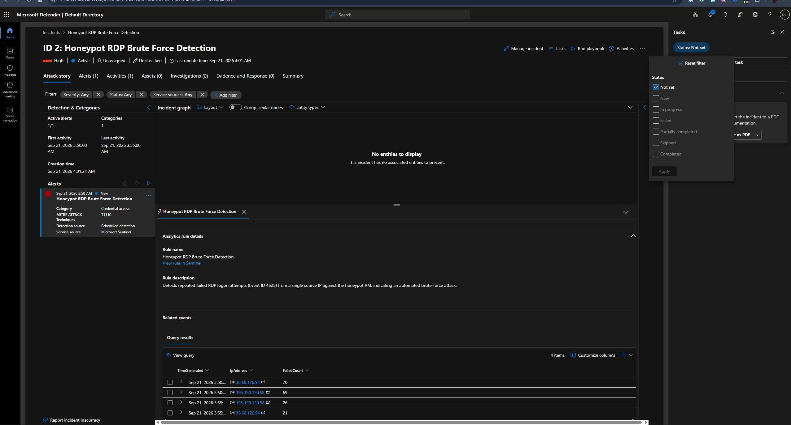
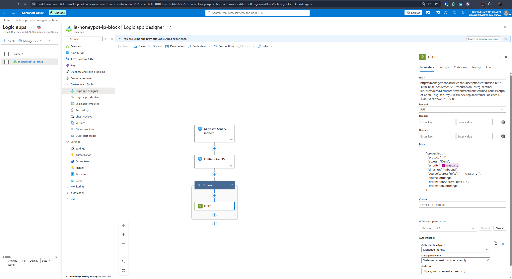

# Azure Sentinel Cloud SOC Lab

A cloud-native SOC analyst portfolio project built entirely on Microsoft Azure, using a public-facing honeypot and Microsoft Entra ID identity monitoring as two independent data sources feeding into Microsoft Sentinel.

This project is a deliberate companion to my [AD/Splunk home lab](#) — that project covers on-prem Active Directory detection and Splunk SOAR automation; this one covers cloud infrastructure exposure and cloud identity monitoring, using Sentinel as the SIEM and Azure Logic Apps for response automation instead of Shuffle.

## Architecture

- **Honeypot VM** (`corpnet-app01`, Windows 11, East US) — deliberately exposed to the public internet: NSG allows all inbound traffic, Windows Firewall disabled. Attracts real, unsolicited internet scanning and brute-force traffic.
- **Microsoft Entra ID** — a test tenant with a dedicated test user, generating real sign-in activity including MFA registration and legacy-auth-style attempts.
- **Log Analytics workspace** (`law-sentinel-lab`) — central log repository for both data sources.
- **Microsoft Sentinel** — connected to the workspace, running analytics rules against both the honeypot's Windows Security Events and Entra ID sign-in logs.
- **Azure Logic App** — automated response playbook triggered on incident creation, resolving attacker IP entities and creating NSG block rules.

## Why two data sources

Most honeypot writeups stop at "here's a map of who attacked me." This project treats the honeypot as one signal among several, and deliberately adds Microsoft Entra ID sign-in monitoring — closer to what most real-world SOC analyst roles actually deal with day to day (cloud identity, not just server-side brute force), and something my on-prem AD project doesn't cover at all.

## Build log

### 1. Honeypot infrastructure
- Resource group, VNet, and a Windows 11 VM deployed in Azure (`Standard_D2nls_v6`)
- NSG configured to allow all inbound traffic (documented, deliberate exposure)
- Windows Firewall disabled across all profiles
- Public reachability confirmed via ping from an external network
- Azure Monitor Agent + Data Collection Rule forwarding Windows Security Events to Log Analytics

### 2. Microsoft Entra ID identity monitoring
- Dedicated test user created in the tenant
- Diagnostic settings configured to stream sign-in logs (interactive, non-interactive, service principal) to the same Log Analytics workspace
- Real sign-in activity generated and confirmed in Sign-in logs

### 3. Analytics rules and incidents
Two scheduled analytics rules built in Sentinel:
- **Honeypot RDP Brute Force Detection** (High severity) — queries `SecurityEvent` for `EventID == 4625`, detecting repeated failed RDP logons from a single source IP against the honeypot.
- **Entra ID Repeated Failed Sign-In Detection** (Medium severity) — queries `SigninLogs` for `ResultType != "0"`, grouped by user, triggering at 3+ failures within a 15-minute window (15-minute schedule, 30-minute suppression).

Both rules validated against real data, not just theoretical logic:
- The honeypot rule fired against live, unsolicited internet traffic — two independent attacker IPs (originating from Indonesia and Russia) generated over 1,900 combined failed RDP logon attempts against the `administrator` account within a 24-hour window, with zero successful authentications confirmed.
- The Entra ID rule was validated by deliberately triggering failed sign-ins (including an Entra ID Smart Lockout event) against a dedicated test account, confirming the rule correctly fires once the threshold is met.

### 4. Geo-enrichment and attack map
Built a Sentinel Workbook ("Honeypot Attack Map") using Log Analytics' built-in `geo_info_from_ip_address()` KQL function to resolve attacker IPs to city/country/latitude/longitude — rather than uploading and maintaining a manual GeoIP watchlist CSV. The map plots attacker IPs as markers sized by failed-attempt count; confirmed real attacker traffic originating from Indonesia, Russia, and Egypt.

### 5. Incident triage
All incidents investigated and formally closed with documented classifications:
- Honeypot incidents classified **True Positive – Malicious user activity**: investigated both source IPs, confirmed no successful authentication occurred despite the volume of attempts.
- Entra ID test incident classified **Informational – Security testing**, since it was a deliberate validation of the detection rule rather than a genuine attack.

### 6. Response automation (Logic App)
Built a Logic App (`la-honeypot-ip-block`) to automate the response to Honeypot RDP Brute Force Detection incidents:
- A Sentinel Automation Rule triggers on new incident creation, filtered to this specific analytics rule, and runs the Logic App.
- The workflow uses the Microsoft Sentinel connector's "Entities - Get IPs" action to resolve the incident's IP entities directly (rather than looping over all entity types and filtering manually).
- A "For each" loop iterates over the resolved IPs, and an HTTP action authenticated via the Logic App's system-assigned managed identity calls the Azure Resource Manager REST API to create a Deny inbound security rule on `corpnet-app01-nsg` for each attacker IP — dynamically generating the rule name and a randomized priority per IP to avoid collisions.
- The managed identity is scoped with Network Contributor access to the NSG resource specifically, not the resource group, following least-privilege.

I also explored adding Microsoft Entra ID Identity Protection / risk-based Conditional Access as a second, identity-layer remediation path alongside the NSG block — documented under Known limitations below.

## Known limitations

- The Honeypot RDP Brute Force Detection rule was not configured with entity mapping (Account/IP/Host) at creation, so its earliest incidents don't show linked entities in the incident graph. Documented here rather than silently fixed, consistent with the AD/Splunk project's approach.
- Microsoft Entra ID Identity Protection and Conditional Access require P1/P2 licensing that this tenant doesn't have, confirmed directly in the Azure portal (both the legacy risk policy blade and Conditional Access itself returned licensing errors when attempting to configure risk-based policies). A second, identity-layer remediation path using these was designed but not implemented as a result — the NSG-based automated block above is the sole automated remediation in this project.

## Screenshots

**Honeypot VM deployed and running**

**MFA registration for the Entra ID test user**

**Entra ID Repeated Failed Sign-In Detection — validation query**

**Honeypot Attack Map workbook — attacker IPs geo-resolved and plotted**

**Honeypot RDP Brute Force Detection — incident view**

**Logic App workflow — Sentinel incident trigger → Entities-Get IPs → For each → HTTP (NSG block)**

